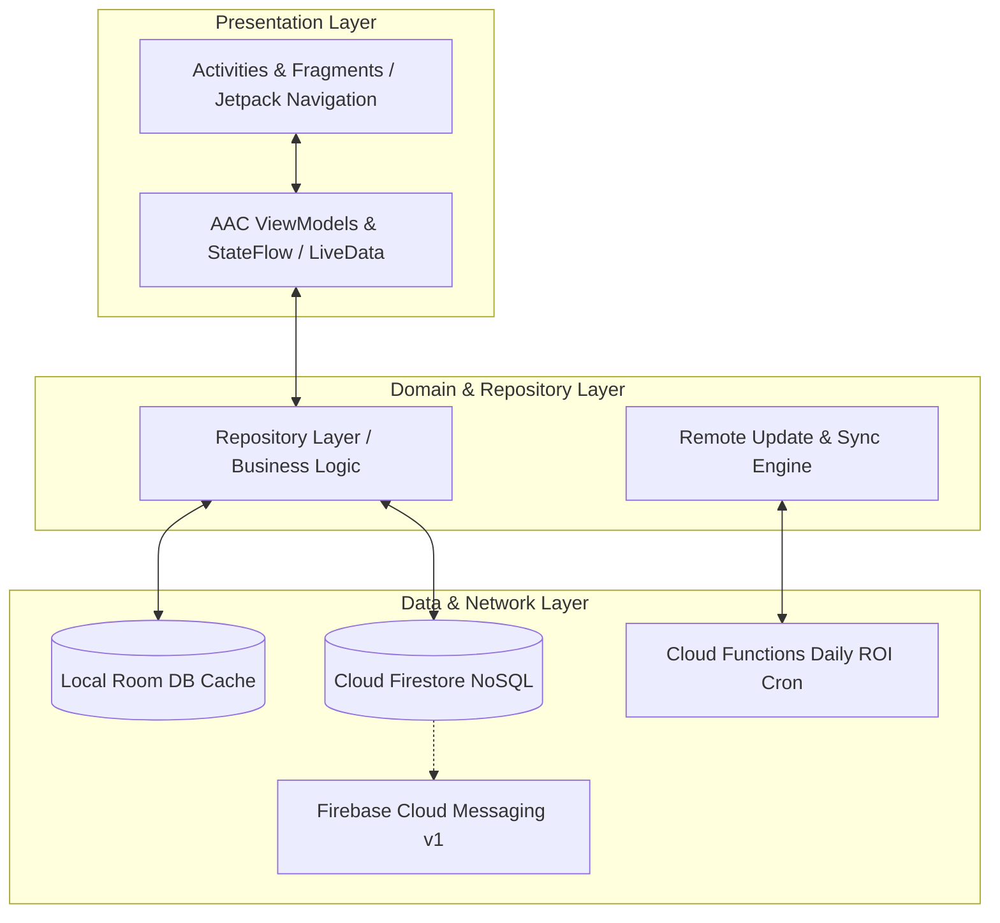
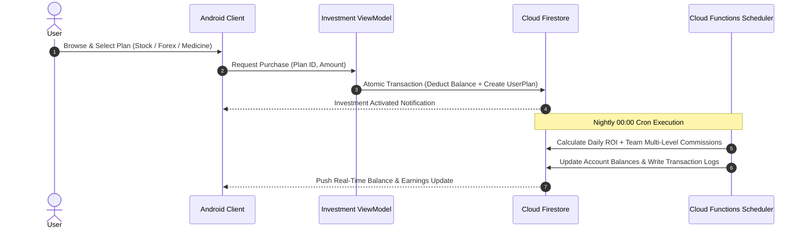

# AI Trust Ledger (User Client)

[](https://developer.android.com)
[](https://kotlinlang.org/)
[](https://developer.android.com)
[](https://developer.android.com/topic/architecture)
[](https://firebase.google.com/docs/firestore)
[](LICENSE)

> Enterprise-grade Android investment and wealth-management client offering multi-asset portfolios (Stocks, Forex, Medical Ventures), multi-tier MLM referral structures, real-time customer support chat, and crypto-backed wallet transactions.

---

## 📖 Overview

**AI Trust Ledger User** is a fintech application designed for modern retail investors seeking diversified digital portfolios and multi-tier affiliate earning opportunities. Engineered with Android architecture best practices (MVVM, Kotlin Coroutines, Jetpack Navigation, and Room caching), the application seamlessly synchronizes with **Firebase Firestore** and **Firebase Cloud Functions** to deliver real-time financial tracking, automated daily ROI accruals, and instantaneous crypto payment verification.

### Core Value Propositions
- **Multi-Category Asset Allocation**: Diversify holdings across high-yield Stocks, Forex pairs, and Medical venture plans with custom lockup durations and daily returns.
- **Hierarchical MLM Affiliate Engine**: Interactive multi-level team explorer that tracks downline network growth, tier turnover, and commission tiers.
- **Crypto & Fiat Wallet Flow**: Streamlined deposit address generation, transaction hash verification, and automated withdrawal processing.
- **Real-Time Support & Direct Messaging**: Built-in Firebase-backed live support channel enabling immediate communication with portfolio administrators.
- **Robust Offline-First Resilience**: Local caching via Android Room and LiveData/Flow pipelines for continuous state availability.

---

## 🏗️ Architecture & Data Flow

AI Trust Ledger is built following the official **Android Clean Architecture & MVVM** guidelines, ensuring clear separation of concerns, testability, and reactive UI updates.



### User Investment & Referral Lifecycle



---

## ✨ Core Features

### 1. 💼 Multi-Market Investment Portfolios
- **Stock Market Investments**: Fixed-term stock plans with defined daily yield rates and maturity dates.
- **Forex Asset Baskets**: Curated foreign exchange currency baskets offering automated returns.
- **Medical & Venture Capital Plans**: Specialized long-term investment tiers with compound bonus structures and capital return upon expiration.

### 2. 👥 Multi-Tier MLM Team & Referral Hierarchy
- **Real-Time Referral Network**: Multi-level tree exploration displaying downline users, direct recruits, and team volume.
- **Commission Tiering**: Dynamic level calculation showing qualified tier status, total active downstream capital, and team earning summaries.
- **Leaderboards & Ranking**: Visual team leaderboards displaying top contributors and active volume badges.

### 3. 💳 Wallet & Transaction Management
- **Crypto Deposits & Withdrawals**: Support for USDT (BEP20 / TRC20) deposit address submission and automated payout processing.
- **Comprehensive Ledger**: Categorized transaction history covering Plan Purchases, Daily ROI Credits, Referral Rewards, Deposits, and Withdrawals with status chips (`Pending`, `Approved`, `Rejected`).

### 4. 💬 Live Support & Secure In-App Chat
- **Help Desk Ticketing**: Create and monitor priority support requests directly from the app.
- **Real-Time Firebase Chat**: Low-latency 1-on-1 customer service chat with admin agents, complete with read receipts and timestamps.

### 5. 🔔 Notifications & In-App Updates
- **FCM Push Messaging**: Instant notifications on daily ROI credits, referral signups, and withdrawal approvals.
- **OTA App Updates**: Built-in remote version checker (`RemoteUpdateManager`) with background APK download and silent package installer hooks.

---

## 📱 Key Screens & Navigation Map

| Screen / Destination | Implementation Class | Description |
|---|---|---|
| **Splash & Auth** | `SplashFragment`, `SignInFragment`, `SignUpFragment` | User authentication, token validation, and deep link routing. |
| **Home Dashboard** | `HomeFragment` | Balance summaries, daily profit indicators, promotional carousel slider, and quick action cards. |
| **Plan Catalogs** | `StockInvestmentPlansFragment`, `MedicineInvestmentPlan`, `ForexInvestmentFragment` | Categorized investment catalog with profit calculators and terms. |
| **Active Holdings** | `BoughtStocks`, `BoughtMedicinesFragment`, `BoughtForexFragment` | Active portfolios with countdown timers, accrued profits, and capital status. |
| **Team & Network** | `TeamLevelsFragment`, `LevelUsersFragment`, `TeamRankingFragment` | Multi-tier affiliate tree viewer, level turnover stats, and ranking boards. |
| **Financial Ledger** | `DepositAmountFragment`, `WithdrawAmountFragment`, `TransactionHistoryFragment` | Fund management, deposit proof uploads, withdrawal requests, and filterable ledger. |
| **Support & Messaging**| `SupportFragment`, `ChatFragment`, `DetailChatFragment` | Direct real-time administrative messaging and issue tracking. |

---

## 🛠️ Technology Stack

| Layer | Technologies / Libraries |
|---|---|
| **Language & Tooling** | Kotlin 2.0, JDK 17/21, Gradle Version Catalogs (`libs.versions.toml`), KSP |
| **UI Framework** | Android Jetpack (ViewBinding, Fragments, Navigation Component, ConstraintLayout, Material Components) |
| **Architecture** | MVVM (Model-View-ViewModel), Repository Pattern, Clean Architecture |
| **Async & Concurrency**| Kotlin Coroutines, StateFlow, LiveData KTX |
| **Local Persistence** | Android Jetpack Room DB, AndroidX Encrypted SharedPreferences |
| **Backend & Cloud** | Google Firebase (Authentication, Cloud Firestore, Cloud Functions, Cloud Storage, FCM v1, Remote Config) |
| **Media & Animation** | Glide 4.16, Lottie Animations, Ultra Pull-To-Refresh, CircleImageView |
| **Networking** | OkHttp3, Volley, gRPC (Protobuf-lite) |

---

## 🚀 Getting Started

### Prerequisites
- **Android Studio Ladybug (2024.2.1+)** or newer.
- **JDK 17** configured in Android Studio Gradle settings.
- **Android SDK Platform 35** with Build-Tools `35.0.0`.
- An active **Firebase Project** with Authentication, Firestore, and Cloud Messaging enabled.

### Installation & Configuration

1. **Clone the Repository**:
   ```bash
   git clone https://github.com/shayann07/AI-Trust-Ledger-User.git
   cd AI-Trust-Ledger-User
   ```

2. **Configure Local Environment**:
   Copy the example properties file and provide your local Android SDK location:
   ```bash
   cp local.properties.example local.properties
   ```
   Edit `local.properties`:
   ```properties
   sdk.dir=C\:\\Users\\<YourUsername>\\AppData\\Local\\Android\\Sdk
   ```

3. **Add Firebase Configuration**:
   Download your `google-services.json` from the Firebase Console and place it into the `app/` directory:
   ```text
   app/google-services.json
   ```

4. **Build and Assemble**:
   ```bash
   # Build Debug APK
   ./gradlew assembleDebug

   # Run Unit Tests
   ./gradlew testDebugUnitTest
   ```

---

## 📄 License

This project is open-source software licensed under the [MIT License](LICENSE) — Copyright (c) 2026 [shayann07](https://github.com/shayann07).
